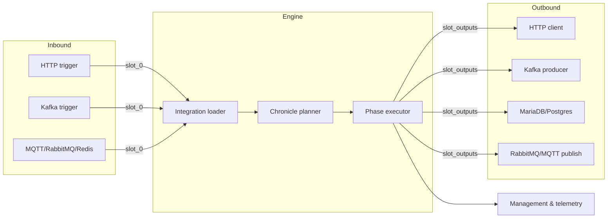

# Chronicle

> Declarative event pipelines that turn configuration into production-grade workflows.

Chronicle is a configuration-driven orchestration engine. You describe ingress
connectors, triggers, and ordered phases in YAML; Chronicle turns that document
into a running system that captures events, enriches them, calls external
systems, and emits telemetry—without writing glue code.

## Why Chronicle
- **Declarative by default** – connectivity, routing, and transformations live in
  one spec; no ad-hoc scripts or hidden business logic.
- **Strict determinism** – missing context keys fail fast, phases are atomic,
  and retries align with the spec rather than ad hoc conventions.
- **Shared abstractions** – connectors encapsulate transport details, `chronicle::phase::utils`
  enforces canonical context resolution, and phases compose HTTP, Kafka, databases, and brokers
  uniformly. The `chronicle::metrics` facade centralizes counters/backpressure snapshots so transports,
  management, and tests expose the same Prometheus families.
- **Deterministic metadata** – triggers and phases carry canonical `trace_id`, `record_id`, and
  `route` metadata via `DomainMessage`/`ExecutionContext`, keeping logs and metrics aligned.
- **Stateless scaling** – every replica loads the same YAML, reuses connector
  pools, and participates in horizontal scaling without coordination.
- **Built-in observability** – readiness endpoints, structured logs, and
  Prometheus metrics expose per-chronicle health out of the box.

## Architecture at a Glance



- **Integration loader** parses the YAML, builds connector registries, and wires
  triggers to chronicles.
- **Chronicle planner** expands each `chronicle` stanza into a dependency graph,
  ready for execution.
- **Phase executor** advances slots (`.[0]`, `.[1]`, …), applying jaq expressions
  and invoking outbound connectors while honoring timeouts and backpressure.
- **Telemetry surface** exposes `/live`, `/ready`, `/status`, and `/metrics`
  endpoints plus structured logs tagged with chronicle/phase identifiers.

## Core Concepts

### Connectors
Reusable endpoint definitions that declare protocol, authentication, TLS, and
pooling details. Connectors are independent of chronicles; they can act as
triggers (role = server/consumer) or outbound clients (role = client/producer).

Supported connector families include HTTP, Kafka, MariaDB/Postgres, RabbitMQ,
MQTT, Redis, MongoDB, gRPC clients, and SMTP. See `examples/spec_connectors.yaml`
for end-to-end samples and `docs/guides/examples.md` for walkthroughs.

### Triggers
Each chronicle begins with a trigger that emits slot `.[0]`. Supported trigger
types (HTTP, Kafka, RabbitMQ, MQTT, MongoDB change streams, Redis streams) keep
the inbound payload as structured JSON, preserving headers, metadata, and broker
attributes.

### Phases
Phases are typed operations (transform, HTTP, Kafka publish, SQL insert, Redis
command, etc.) that read previous slots and write their own output (`.[n]`).
Phases use jaq expressions to compose requests. Parallel phases allow a single
level of fan-out with configurable aggregation rules.

### Management Surface
When `management` is configured, Chronicle exposes:
- `/live` – process liveness
- `/ready` – readiness graph plus `Retry-After`
- `/status` – route and endpoint state snapshot
- `/metrics` – Prometheus counters/gauges, including readiness, queue depth
  (`route_queue_depth{route}`), shed counters (`chronicle_shed_total{route}`),
  and half-open probe gauges (`chronicle_half_open_probe_concurrency{endpoint}`)

See `docs/guides/observability.md` for schemas and dashboards.

### Canonical Record Schema
Examples share a neutral record layout to keep documentation consistent:

```yaml
record:
  id: <string>
  attributes:
    category: <string>
    tier: <string>
  metrics:
    latency_ms: <number>
    retries: <number>
  observed_at: <RFC3339 timestamp>
```

Triggers populate `.[0].record.*`; each phase writes to the next slot, so later
phases can reference `.[]` paths deterministically.

## Quick Start

```bash
cargo run -- --config tests/fixtures/chronicle-integration.yaml
```

1. Chronicle loads `ChronicleConfig` (environment + `config/*.toml`).
2. The integration YAML is parsed into connectors and chronicles.
3. Connector registries spin up HTTP servers, Kafka/MQTT/RabbitMQ consumers,
   database pools, and outbound clients.
4. Triggers register and begin accepting traffic while `/ready` reports warm-up
   progress.

Structured telemetry is enabled by default; set `RUST_LOG` or
`CHRONICLE__TELEMETRY__FILTER` to adjust verbosity.

## Config Workflow
1. **Connectors** – declare every external dependency once. TLS/auth blocks are
   first-class; unknown keys fail fast thanks to `serde(deny_unknown_fields)`.
2. **Chronicles** – pick a trigger (`http_server`, `kafka`, etc.) and list
   phases. The engine maps each phase to a slot.
3. **Limits & warm-up** – size `app.limits.routes.max_inflight`, keep
   `app.limits.routes.max_queue_depth` at least the 1024 default unless a chronicle
   truly benefits from a smaller buffer, and cap ingress via
   `app.limits.http.max_concurrency`. Pair those knobs with connector warm-up
   budgets so readiness reflects reality before live traffic arrives.
4. **Schema validation** – use the bundled JSON Schema (`docs/reference/chronicle.schema.json`)
   to validate configs before rollout. Run `make schema-validate CONFIG=path/to/config.yaml`
   (or `cargo run -- validate path/to/config.yaml`) to catch drift early; CI
   runs the same check against the fixture.
5. **Management** – enable `management` to expose readiness + metrics, and tune
   `app.readiness_cache` (defaults to 250 ms, minimum 50 ms) so probes stay
   responsive without thrashing. Chronicle caches the readiness verdict for that
   window and reuses it inside HTTP handlers to fast-path 503/Retry-After logic.

Refer to `docs/specification.md` whenever you evolve the schema, and update the
supporting guides for operational or observability changes.

## Supported Connectors & Phases

- **HTTP server/client** – ingress APIs and outbound REST calls.
- **Kafka** – producers and consumers with TLS/SASL.
- **MQTT & RabbitMQ** – triggers and publishers with shared backoff helpers.
- **Redis & MongoDB** – Pub/Sub, streams, CRUD, and change streams.
- **MariaDB/Postgres** – pooled SQL access for idempotent inserts and queries.
- **gRPC & SMTP** – outbound calls for enrichment or notifications.

The same phase primitives handle serialization (Avro/Protobuf), base64 payloads,
timeouts, and structured error reporting across transports.

## Tooling & Environment
- **Integration harness** – `e2e/docker-compose.yaml` provisions Kafka,
  RabbitMQ, MQTT, Postgres, MongoDB, and Redis for end-to-end tests.
- **Feature flags** – `connector_flags.*` in `config/local.toml` let you ship
  new connectors disabled, then flip them per environment.
- **Documentation** – see `docs/README.md` for layout, plus:
  - `docs/specification.md` (contract)
  - `docs/guides/operations.md` (runbooks & backpressure)
  - `docs/guides/observability.md` (dashboards, alerts)
  - `docs/guides/security.md` (TLS/auth guidance)
  - `docs/guides/examples.md` (end-to-end samples)
- **Planning** – roadmap artifacts live under `planning/`
  (`planning/backlog.md`, `planning/gap_matrix.md`, etc.) to keep user-facing
  docs tidy.

## Developer Workflow

Run the consolidated gate before every PR:

```bash
make verify
```

`make verify` runs `cargo fmt`, `clippy --all-targets --all-features`, the full
test suite, `cargo check` for both `--no-default-features` and `--features full`,
and the audit/size scripts. `SKIP_AUDIT=1` or `SKIP_SIZE_CHECK=1` can defer
heavy steps locally; CI always runs them.

Transport changes should also exercise the harness:

```bash
make harness-up
make integration-tests
make harness-down
```

CI mirrors `make verify`, then layers on the docker-compose harness, smoke test,
and benchmarks via `tools/ci_checks.sh`. Observability guidance for on-call
teams lives in `docs/guides/observability.md`.

## Contributing

- Treat the YAML spec as the source of truth. Add options there first and keep
  fixtures (`tests/fixtures/*.yaml`) in sync.
- Emit structured logs with chronicle/phase identifiers; telemetry tests rely on
  those fields.
- Update documentation alongside code: README for landing info, the spec for
  schema changes, and the guides for operational behavior.
- Before opening a PR, run the developer workflow, ensure
  `cargo test --test integration` passes, and refresh any relevant docs or
  planning artifacts.
